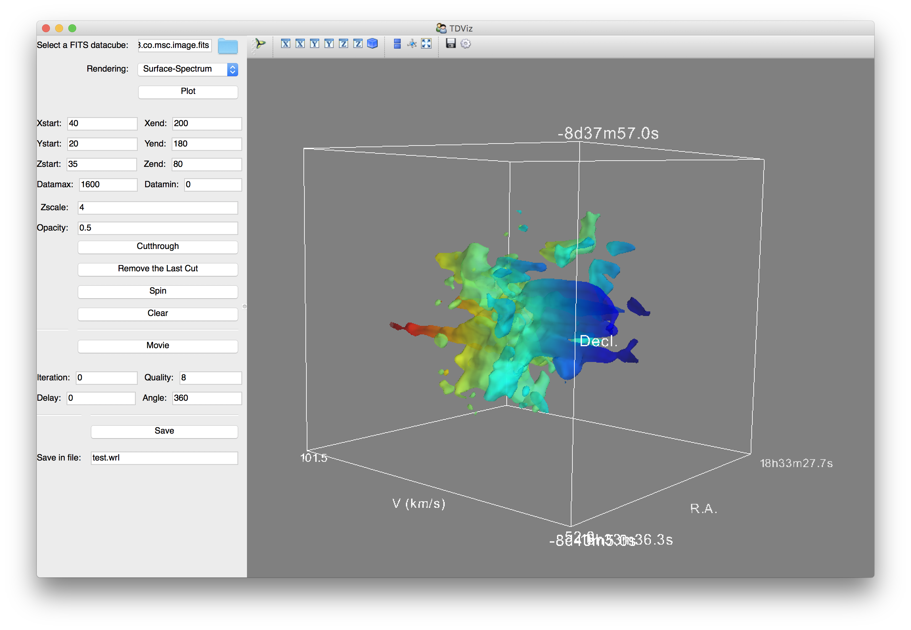

# A simple tool of visualizing 3-D datacubes in FITS format

The visualization is implemented by MayaVI and the interface is made with TraitsUI.
It stems from my homework for the [ay201b](https://ay201b.wordpress.com/topical-modules/2013-topical-modules/) course.

## Denpendencies

* Mayavi,
* pyface,
* Trauts,
* TraitsUI,
* astropy,
* numpy,
* scipy,
* (optional) and ImageMagick to make GIF movies.

## Versions

There seems to be some conflicts between latest versions of numpy and Traits.

Please try using the following versions, which work well for me:
* mayavi==4.3.0
* pyface==4.3.0
* traits==4.3.0
* traitsui==4.3.0
* numpy==1.9.1
* astropy==2.0.2

## Render the P-P-V datacubes in three options

1. Iso-surfaces colored by velocities.
2. Iso-surfaces colored by intensities.
3. Scattered dots colored by intensities.

The first two can be saved in a 'mesh' file and be imported to softwares such as Blender or Meshlab, and be uploaded to Sketchfab.

## Known issues

1. Cannot load a different fits file if the current file name includes path: have to delete the current 'fitsfile' name, then nagivate to the new fits file.
2. The latest Mayavi (v4.4+) does not allow a random name for a new attribute of a field. I have to revert to the previous Mayavi version (v4.3).
3. To be found...
